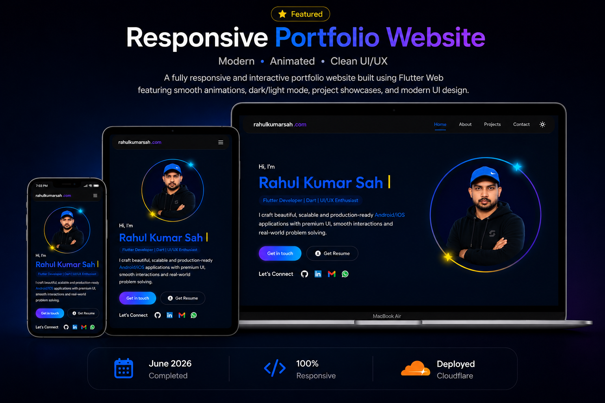

# Rahul Kumar Sah - Portfolio

A premium personal portfolio website built with Flutter Web showcasing my projects, skills, education, and professional journey as a Flutter Developer.

## Live Website

🌐 https://rahulkumarsah.com

## Preview



---

## About

This portfolio highlights my experience in Flutter development, cross-platform applications, UI design, backend integrations, and modern web technologies.

Built with a strong focus on:

- Premium UI/UX
- Responsive Design
- SEO Optimization
- Performance
- Recruiter-Friendly Layout
- Dark / Light Theme Support

---

## Tech Stack

### Frontend
- Flutter
- Dart

### State Management
- Riverpod
- Provider
- GetX

### Backend & Database
- Firebase
- Firestore
- Supabase

### APIs & Services
- REST APIs
- Google Maps API
- Firebase Cloud Messaging (FCM)

### Local Storage
- Hive
- Shared Preferences

### Tools
- Git
- GitHub
- Postman
- Android Studio
- VS Code

---

## Featured Projects

### QuizOPro - AI Powered Quiz App

An AI-powered quiz platform with dynamic question generation and real-time data synchronization.

#### Features
- AI Generated Quizzes
- Firebase Authentication
- Real-time Firestore Database
- Dynamic Difficulty Levels
- Leaderboard System
- Responsive UI

#### Tech Stack
Flutter • Firebase • Firestore • GetX • REST API

---

### LocalMate - Community Service App

A community-driven local services platform helping users connect with nearby service providers.

#### Features
- Nearby Service Discovery
- Real-time Location Features
- Google Maps Integration
- Push Notifications
- Modern State Management

#### Tech Stack
Flutter • Supabase • Riverpod • Google Maps API • FCM

---

## Portfolio Features

- Fully Responsive Layout
- Dark / Light Theme
- Smooth Animations
- Resume Viewer
- Resume Download
- Contact Form Integration
- SEO Meta Tags
- Open Graph Support
- Custom Domain Setup

---

## Project Structure

```text
lib/
│
├── core/
├── data/
├── models/
├── providers/
├── services/
├── utils/
├── views/
│   ├── sections/
│   └── widgets/
│
└── main.dart
```

---

## Local Setup

Clone the repository:

```bash
git clone https://github.com/rahulkumarsah1999/rahulkumarsah-portfolio.git
```

Navigate to project:

```bash
cd rahulkumarsah-portfolio
```

Install dependencies:

```bash
flutter pub get
```

Run project:

```bash
flutter run -d chrome
```

---

## Build for Web

```bash
flutter build web --release
```

Output:

```text
build/web
```

---

## Resume

Available inside:

```text
web/resume.html
web/resume.pdf
```

---

## Contact

### Rahul Kumar Sah

📧 rkhhp713@gmail.com

📱 +91 7902070478

🌐 https://rahulkumarsah.com

💼 https://github.com/rahulkumarsah1999

---

## License

This project is intended for personal portfolio and showcase purposes.

© 2026 Rahul Kumar Sah. All Rights Reserved.